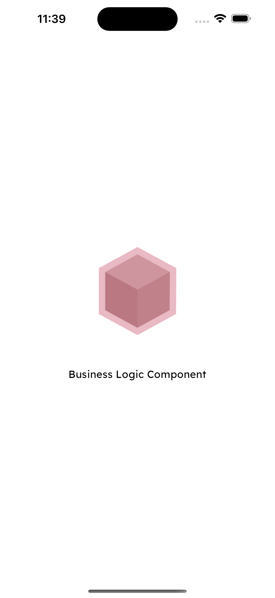
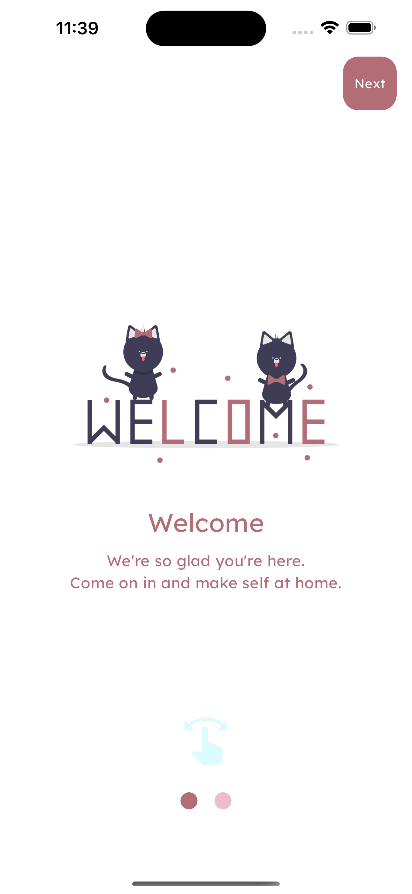
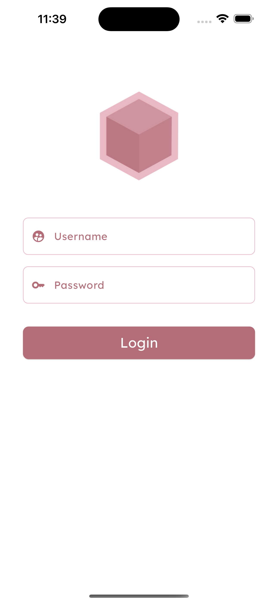
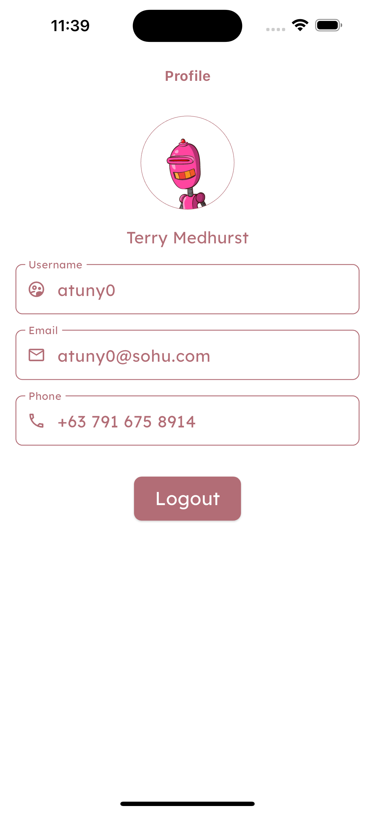

# Flutter BLoC Example

A Flutter project showcasing the BLoC (Business Logic Component) pattern for state management. The application includes a splash screen, onboarding screen, login screen, and profile screen.

## Test user:
* username : kminchelle
* password : 0lelplR

## Splash Screen

The splash screen is the initial screen that appears when the app is launched. It provides a visually appealing introduction to the application and sets the stage for the user experience.

## Onboarding Screen

The onboarding screen is designed to introduce users to the key features and benefits of the app. It often includes swipable slides with information about the app's functionality.

## Login Screen

The login screen allows users to authenticate and access personalized content. It typically includes fields for entering credentials and buttons for login or registration.

## Profile Screen

The profile screen displays user information Users.

## Getting Started
clone https://github.com/AsmarV/Bloc_example.git

## Dependencies

The project uses the following dependencies:

- **equatable: ^2.0.5**
    - A package to simplify equality comparisons for Dart classes.
    - [equatable on pub.dev](https://pub.dev/packages/equatable)

- **flutter_bloc: ^8.1.3**
    - The official state management solution for Flutter applications, based on the BLoC (Business Logic Component) pattern.
    - [flutter_bloc on pub.dev](https://pub.dev/packages/flutter_bloc)

- **http: ^1.1.2**
    - A package for making HTTP requests in Dart, used for network communication.
    - [http on pub.dev](https://pub.dev/packages/http)

- **get_storage: ^2.1.1**
    - A simple key-value storage library for Flutter, used for storing data persistently.
    - [get_storage on pub.dev](https://pub.dev/packages/get_storage)

- **flutter_launcher_icons: ^0.13.1**
    - A Flutter package for configuring custom app icons for both Android and iOS.
    - [flutter_launcher_icons on pub.dev](https://pub.dev/packages/flutter_launcher_icons)

Make sure to check the respective links to the documentation on pub.dev for each package for more information and usage instructions.